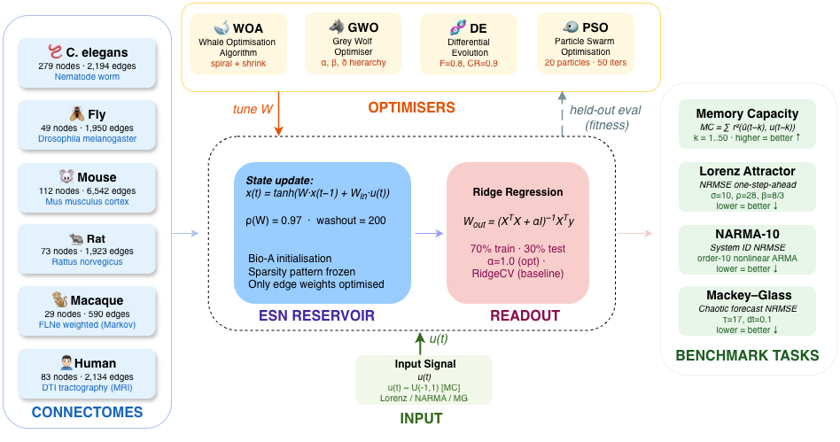

<div align="center">

# Wild Reservoirs

### *Bio-Inspired Swarm Optimisation of Neural Connectomes — from Worm to Human*

**Can algorithms born from animal behaviour outperform what evolution wired into animal brains?**

[](https://python.org)
[](https://pytorch.org)
[](LICENSE)
[](https://www.upm.es)

</div>

---

## The Idea

Biological connectomes — the complete synaptic wiring diagrams of nervous systems — are natural substrates for reservoir computing. They are sparse, small-world, and shaped by evolution to process temporal information efficiently. But can bio-inspired optimisers make them *better*?

We fix the biological sparsity pattern of **six real connectomes** (worm to human) and apply **four gradient-free swarm optimisers** to tune the edge weights. All four consistently and significantly outperform the unoptimised biological baseline across four benchmark tasks — with the Whale Optimisation Algorithm achieving up to a **17× memory improvement** and **89% NRMSE reduction**.

---

## Architecture



*Six biological connectomes seed the ESN weight matrix. Four bio-inspired optimisers tune edge weights via a held-out fitness loop. A ridge regression readout maps reservoir states to predictions on four benchmark tasks.*

---

## Six Real Connectomes

| Animal | Nodes | Edges | Density | Method |
|--------|------:|------:|--------:|--------|
| *C. elegans* — nematode worm | 279 | 2,194 | 2.8% | Electron microscopy |
| *Drosophila* — fruit fly | 49 | 1,950 | 82.9% | Confocal fluorescence |
| Mouse cortex | 112 | 6,542 | 52.6% | Axonal tracing |
| Rat cortex | 73 | 1,923 | 36.6% | Axonal tracing |
| Macaque (FLNe weighted) | 29 | 590 | 72.7% | Retrograde tracing |
| Human cortex (DTI) | 83 | 2,134 | 31.4% | Diffusion MRI |

All connectomes downloaded automatically via [`netneurotools`](https://github.com/netneurolab/netneurotools). No synthetic data.

---

## Four Bio-Inspired Optimisers

| Algorithm | Inspired By | Key Parameters |
|-----------|-------------|----------------|
| **PSO** — Particle Swarm Optimisation | Bird flocking | w=0.7, c1=c2=2.0 |
| **DE** — Differential Evolution | Genetic mutation | F=0.8, CR=0.9 |
| **GWO** — Grey Wolf Optimiser | Wolf pack hierarchy | α, β, δ leaders |
| **WOA** — Whale Optimisation Algorithm | Humpback bubble-net | spiral b=1.0 |

All algorithms share an identical budget: **20 particles × 50 iterations = 1,000 evaluations per run**, evaluated in parallel on GPU.

---

## Four Benchmark Tasks

| Task | What It Measures | Metric |
|------|-----------------|--------|
| **Memory Capacity (MC)** | Linear short-term memory: how many past inputs can the reservoir recall? | MC = Σ r²(û(t−k), u(t−k)), k=1..50 — higher is better |
| **Lorenz Attractor** | One-step-ahead prediction of chaotic dynamics (σ=10, ρ=28, β=8/3) | NRMSE — lower is better |
| **NARMA-10** | Nonlinear system identification requiring 10-step memory | NRMSE — lower is better |
| **Mackey–Glass** | Chaotic time-series forecasting (τ=17, chaotic regime) | NRMSE — lower is better |

---

## Key Results

| Metric | Best Result | Species | Algorithm |
|--------|------------|---------|-----------|
| Max MC improvement | 17× (1.39 → 23.91) | *C. elegans* | WOA |
| Max NRMSE reduction | 89% (Mackey–Glass) | Human | WOA |
| Mean improvement across all species × tasks | +214% | — | WOA |
| Algorithm ranking | WOA > GWO > DE > PSO | — | — |

**Critical finding:** Random initialisation on the same topology consistently underperforms the biological baseline — the biological *weight values*, not just the sparsity pattern, are an essential inductive bias that 1,000 gradient-free evaluations cannot recover from scratch.

---

## Quick Start

```bash
git clone https://github.com/Anmol2059/pso-connectome-reservoirs.git
cd pso-connectome-reservoirs

python -m venv venv && source venv/bin/activate
pip install -r requirements.txt

# Install conn2res (ESN library)
git clone https://github.com/netneurolab/conn2res.git
cd conn2res && pip install --no-deps . && cd ..

# Run full pipeline (~70-100 min on GPU)
cd project && bash run.sh
```

---

## Pipeline

```
bash run.sh
├── step02_baselines.py        →  biological baselines (MC, Lorenz, NARMA, MG) for all 6 species
├── step03_pso.py              →  PSO · DE · GWO · WOA optimisation, all species × tasks × 10 runs
└── step06_publication_figures.py  →  all paper figures (heatmap, radar, convergence, etc.)
```

Results saved to `project/data/opt_results.csv`.

---

## Repository Structure

```
pso-connectome-reservoirs/
├── project/
│   ├── data/
│   │   ├── opt_results.csv          # all optimisation results (6 species × 4 tasks × 4 algorithms × 10 runs)
│   │   ├── baseline_results.csv     # biological baseline scores
│   │   └── {species}/conn_*.npy    # optimised weight matrices
│   ├── images/                      # all publication figures
│   ├── step02_baselines.py
│   ├── step03_pso.py
│   └── step06_publication_figures.py
├── overleaf-pso-paper/              # LaTeX source (linked to Overleaf)
│   ├── bio-inspired.tex
│   └── images/
└── requirements.txt
```

---

## Runtime

| Hardware | Estimated Time |
|----------|:--------------:|
| NVIDIA GPU (CUDA) | ~70–100 min |
| Apple Silicon (MPS) | ~90–120 min |
| CPU only | ~5–7 hr |

---

## Citation

```
A. Guragain, S. Kakalis, and J. I. Godino-Llorente,
"The Whale That Outswam Evolution: Swarm Intelligence Maximises Memory in Connectome Reservoirs,"
ETSI de Telecomunicación, Universidad Politécnica de Madrid, 2025.
```

---

## Acknowledgements

[Varshney 2011](https://doi.org/10.1371/journal.pcbi.1001066) · [Chiang 2011](https://doi.org/10.1016/j.cub.2010.11.056) · [Rubinov 2015](https://doi.org/10.1073/pnas.1420315112) · [Bota 2015](https://doi.org/10.1073/pnas.1504394112) · [Markov 2014](https://doi.org/10.1093/cercor/bhs270) · [Cammoun 2012](https://doi.org/10.1016/j.jneumeth.2011.09.031) · [netneurotools](https://github.com/netneurolab/netneurotools) · [conn2res](https://github.com/netneurolab/conn2res)

---

<div align="center">

**Anmol Guragain · Savvas Kakalis · Juan Ignacio Godino-Llorente**

*ETSI de Telecomunicación, Universidad Politécnica de Madrid*

</div>
